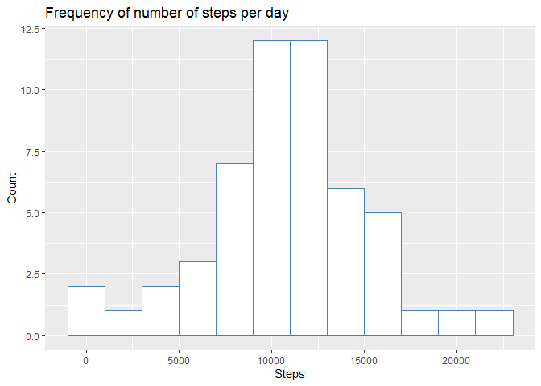
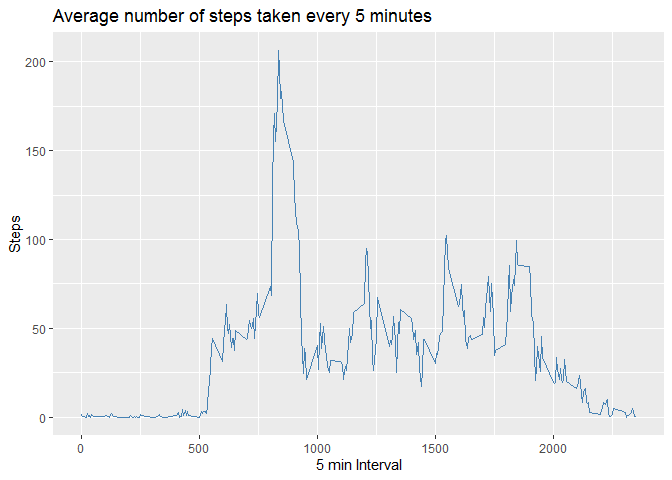
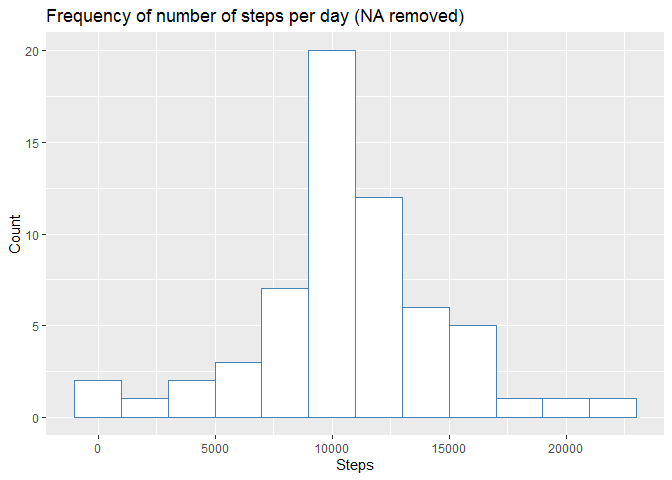
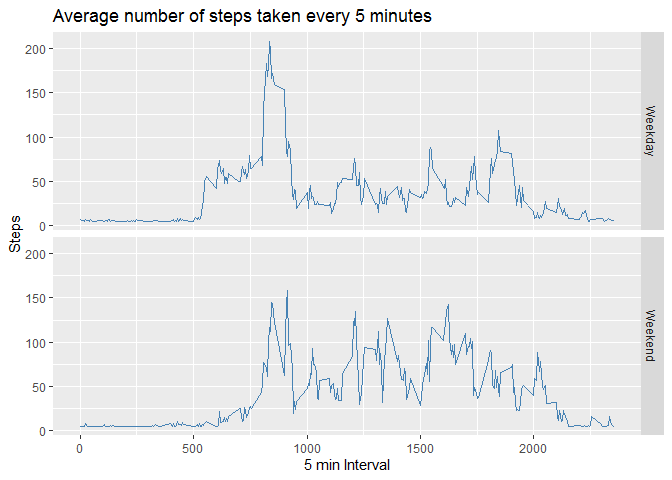

## Loading and preprocessing the data


```r
data <- read.csv("activity.csv")
data$date <- ymd(data$date)
data1 <- na.omit(data)
summary(data1)
```

```
##      steps             date               interval     
##  Min.   :  0.00   Min.   :2012-10-02   Min.   :   0.0  
##  1st Qu.:  0.00   1st Qu.:2012-10-16   1st Qu.: 588.8  
##  Median :  0.00   Median :2012-10-29   Median :1177.5  
##  Mean   : 37.38   Mean   :2012-10-30   Mean   :1177.5  
##  3rd Qu.: 12.00   3rd Qu.:2012-11-16   3rd Qu.:1766.2  
##  Max.   :806.00   Max.   :2012-11-29   Max.   :2355.0
```

## What is mean total number of steps taken per day?

```r
dataperday <- group_by(data1, date)%>%
  summarise(steps=sum(steps))

ggplot(dataperday, aes(steps))+
  geom_histogram(binwidth = 2000, color="steelblue", fill="white")+
  labs(title="Frequency of number of steps per day", x="Steps", y = "Count")
```

<!-- -->

```r
mean(dataperday$steps)
```

```
## [1] 10766.19
```

```r
median(dataperday$steps)
```

```
## [1] 10765
```

The mean number of steps taken each day is 10766.

The median number of steps taken each day is 10765

## What is the average daily activity pattern?

```r
dataperinterval <- group_by(data1, interval)%>%
  summarise(steps=mean(steps))

ggplot(dataperinterval, aes(x=interval,y=steps)) + 
  geom_line(color="steelblue")+
  labs(title="Average number of steps taken every 5 minutes", x="5 min Interval", y="Steps")
```

<!-- -->

```r
dataperinterval[which.max(dataperinterval$steps),] 
```

```
## # A tibble: 1 x 2
##   interval steps
##      <int> <dbl>
## 1      835  206.
```
The maximum number of steps is in the  835th interval

## Imputing missing values
Imputing missing values by replacing them with the mean number of steps for all intervals and dates

```r
sum(is.na(data))
```

```
## [1] 2304
```

```r
impute.data <- data
impute.data$steps[is.na(impute.data$steps)] <- mean(impute.data$steps,na.rm=TRUE)
colSums(is.na(impute.data))
```

```
##    steps     date interval 
##        0        0        0
```

```r
dataperday2 <- group_by(impute.data, date)%>%
  summarise(steps=sum(steps))

ggplot(dataperday2, aes(steps))+
  geom_histogram(binwidth = 2000, color="steelblue", fill="white")+
  labs(title="Frequency of number of steps per day (NA removed)", x="Steps", y = "Count")
```

<!-- -->

```r
mean(dataperday2$steps)
```

```
## [1] 10766.19
```

```r
median(dataperday2$steps)
```

```
## [1] 10766.19
```
The median and the mean are now the same. This means that replacing NAs with the mean of the data makes it more
normally distributed. 

## Are there differences in activity patterns between weekdays and weekends?

```r
impute.data$typeday <- ifelse(weekdays(impute.data$date) %in% c("lördag","söndag"), "Weekend", "Weekday")

impute.dataperinterval <- group_by(impute.data, interval, typeday)%>%
  summarise(steps=mean(steps))

ggplot(impute.dataperinterval, aes(x=interval,y=steps)) + 
  geom_line(color="steelblue")+
  facet_grid(typeday~.)+
  labs(title="Average number of steps taken every 5 minutes", x="5 min Interval", y="Steps")
```

<!-- -->

On weekdays people seem to be active earlier than on weekends and more active in the early hours. 
On weekend people seem to be more active throughout the day. 
